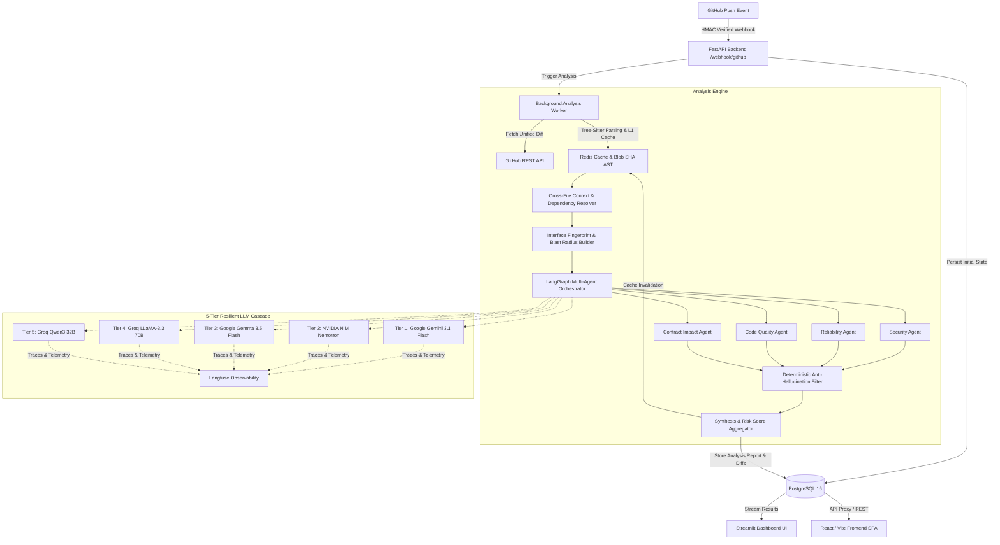

# GitSense AI — Multi-Agent Engineering Intelligence Platform

<p align="center">
  
  
  
  
  
  
  
</p>

> **GitSense AI** is an automated **Engineering Intelligence & Blast Radius Platform**. It integrates directly with GitHub repositories via webhooks, tracks cross-file semantic dependencies and interface contracts using Tree-sitter AST analysis, orchestrates a **multi-agent LangGraph pipeline** across a **5-tier resilient LLM cascade**, and generates copy-pasteable code fixes and executive risk reports in real-time.

---

## 🌟 Key Highlights

- **Automated GitHub Webhook Ingestion**: Receives `push` events in real-time with HMAC SHA256 signature verification and idempotent commit tracking.
- **Tree-sitter AST & Interface Fingerprinting**:
  - Content-addressable AST metadata caching using Git Blob SHAs.
  - Tracks public function/class signatures across commits (`FileInterface`).
  - Detects breaking API changes and signature parameter mismatches before code hits production.
- **Cross-File Dependency & Blast Radius Analysis**:
  - Dynamically builds a dependency graph of imports and exported symbols.
  - Computes transitive importers and affected modules across the repository.
  - Line-level diff annotations `[Lxx]` with exact line numbers for high model precision.
- **Multi-Agent LangGraph Pipeline (Orchestrator-Workers)**:
  - **Security Agent**: Flags injection risks, authorization bypasses, data exposure, and unsafe operations.
  - **Reliability & Logic Agent**: Detects race conditions, unhandled exceptions, and runtime pitfalls.
  - **Code Quality Agent**: Analyzes maintainability, anti-patterns, and architectural standards.
  - **Contract & Impact Agent**: Evaluates cross-file breaking changes and documentation gaps.
  - **Synthesis Agent**: Deduplicates overlapping findings and calculates a comprehensive Risk Score (0.0 – 10.0 scale).
- **Deterministic Zero-Cost Validation (Anti-Hallucination)**:
  - Evidence-presence verification against raw diffs and extracted context.
  - Self-contradiction and self-negating finding rejection.
  - Scope/symbol existence validation via AST passes.
  - Severity auto-calibration and non-actionable noise elimination.
- **5-Tier Resilient Provider Cascade**:
  - Dynamic workload-weighted routing across **Google Gemini Flash**, **Google Gemma/Flash-Lite**, **NVIDIA NIM** (Nemotron), **Groq LLaMA-3.3 70B**, and **Groq Qwen3 32B**.
  - Dual token (TPM) and request (RPM/RPD) sliding-window rate limiters preventing 429 errors.
  - Distributed LLM observability and distributed tracing with **Langfuse**.
- **Dual Dashboard Interfaces**:
  - **Streamlit App**: Real-time commit feed, severity-coded issue cards, unified-diff syntax highlighting, and downloadable **PDF Executive Reports**.
  - **React / Vite / Tailwind SPA**: Modern interactive dashboard with Blast Radius visualizer, metrics overview, and commit simulation.

---

## 📐 Architecture & Data Flow



---

## 🗂️ Repository Structure

```text
Gitsense/
├── .gitignore                           # Master repository .gitignore
├── README.md                            # Project overview & quickstart (this file)
├── PROJECT_DOCUMENTATION.md             # Complete architecture & design specs
│
├── gitsense/                            # Core Application Package
│   ├── docker-compose.yml               # Multi-container orchestration (DB, Redis, Backend, Frontend)
│   ├── .env.example                     # Environment template
│   ├── .gitignore                       # Package-level ignore rules
│   │
│   ├── backend/                         # FastAPI Application & Analysis Engine
│   │   ├── main.py                      # Application entrypoint & CORS middleware
│   │   ├── config.py                    # Pydantic BaseSettings configuration
│   │   ├── database.py                  # Async SQLAlchemy Engine & Session provider
│   │   ├── alembic.ini                  # Database migration configuration
│   │   ├── alembic/                     # Database schema migrations
│   │   ├── models/                      # SQLAlchemy ORM Data Models
│   │   │   ├── user.py                  # User entity (OAuth credentials)
│   │   │   ├── repo.py                  # Connected repositories
│   │   │   ├── commit.py                # Commit tracking & status
│   │   │   ├── report.py                # Commit analysis report & metrics
│   │   │   ├── file_interface.py        # Cached AST interface signatures
│   │   │   ├── file_dependency.py       # Import & exported symbol mappings
│   │   │   └── notification.py          # Alerts & notification feed
│   │   ├── routes/                      # REST Endpoints
│   │   │   ├── auth.py                  # GitHub OAuth authentication
│   │   │   ├── repos.py                 # Repository connection management
│   │   │   ├── webhook.py               # GitHub Webhook handler
│   │   │   └── commits.py               # Commit feed & report queries
│   │   ├── schemas/                     # Pydantic Schemas & DTOs
│   │   │   ├── analysis.py              # LLM output contracts & issue models
│   │   │   └── commit.py                # Dashboard response models
│   │   └── services/                    # Business Logic & AI Pipeline
│   │       ├── analysis_graph.py        # LangGraph multi-agent analysis orchestrator
│   │       ├── providers.py             # 5-tier LLM cascade with TPM/RPM limiters
│   │       ├── blast_radius_builder.py  # Blast radius & affected module calculation
│   │       ├── cross_file_resolver.py   # Cross-file import & context extraction
│   │       ├── interface_tracker.py     # Signature diffing & API contract tracking
│   │       ├── dependency_graph.py      # Dependency sync & transitive importers
│   │       ├── ast_cache.py             # Tree-sitter AST & blob SHA cache
│   │       ├── diff_annotator.py        # Line-number diff prefixing [Lxx]
│   │       ├── file_classifier.py       # Diff tier classification & language detection
│   │       ├── redis_client.py          # Redis connection pool & helpers
│   │       ├── api_logger.py            # API error logging
│   │       └── github.py                # GitHub REST API client
│   │
│   └── frontend/                        # Streamlit Web Application
│       ├── app.py                       # Streamlit dashboard interface
│       └── pdf_utils.py                 # PDF report generation utility
│
└── Actual Frontend/                     # Modern React / Vite / Tailwind SPA
    ├── src/
    │   ├── components/                  # UI components (BlastRadiusViewer, DiffViewer, etc.)
    │   ├── services/api.ts              # API client connecting to FastAPI backend
    │   └── App.tsx                      # Main dashboard application
    ├── server.ts                        # Express server & backend API proxy
    ├── vite.config.ts                   # Vite configuration
    └── package.json                     # Frontend dependencies
```

---

## 🚀 Quick Start

### 1. Prerequisites

- **Docker & Docker Compose** (Recommended)
- **Python 3.12+**
- **Node.js 18+** (Optional, for React frontend)
- Free API Keys for LLM Providers:
  - [Groq Console](https://console.groq.com/keys)
  - [Google AI Studio](https://aistudio.google.com/apikey)
  - [NVIDIA NIM](https://build.nvidia.com)
  - [Langfuse](https://cloud.langfuse.com) (Optional, for observability)

---

### 2. Environment Configuration

Copy the example environment file inside `gitsense/` and fill in your credentials:

```bash
cd gitsense
cp .env.example .env
```

Key environment variables:

```ini
APP_SECRET_KEY=generate-a-secure-secret-key
DATABASE_URL=postgresql+asyncpg://postgres:1234@db:5432/gitsense
REDIS_URL=redis://redis:6379/0

# GitHub OAuth & Webhooks
GITHUB_CLIENT_ID=your_github_client_id
GITHUB_CLIENT_SECRET=your_github_client_secret
GITHUB_WEBHOOK_SECRET=your_webhook_secret_key
WEBHOOK_BASE_URL=https://your-domain-or-ngrok-url

# LLM Providers (Multi-Tier Cascade)
GROQ_API_KEY=gsk_xxxxxxxxxxxx
GOOGLE_API_KEY=AIzaxxxxxxxxxxxx
GOOGLE_API_KEY_2=AIzaxxxxxxxxxxxx  # Optional secondary key
NVIDIA_API_KEY=nvapi-xxxxxxxxxxxx

# Observability
LANGFUSE_PUBLIC_KEY=pk-lf-xxxxxxxxxxxx
LANGFUSE_SECRET_KEY=sk-lf-xxxxxxxxxxxx
LANGFUSE_HOST=https://cloud.langfuse.com
```

---

### 3. Run with Docker Compose (Recommended)

Start PostgreSQL, Redis, FastAPI Backend, and the Streamlit Frontend in one command:

```bash
cd gitsense
docker-compose up --build -d
```

- **Backend API**: `http://localhost:8000` (Swagger docs at `/docs`)
- **Streamlit Dashboard**: `http://localhost:8501`
- **PostgreSQL**: `localhost:5432`
- **Redis**: `localhost:6379`

To view container logs:
```bash
docker-compose logs -f backend
```

---

### 4. Manual Local Development

If running locally without full Docker containers:

#### A. Start Databases
```bash
# Start Postgres & Redis only
cd gitsense
docker-compose up -d db redis
```

#### B. Setup & Run Backend
```bash
cd gitsense

# Create virtual environment
python -m venv venv
.\venv\Scripts\Activate.ps1   # On Windows
# source venv/bin/activate    # On Linux/macOS

# Install dependencies
pip install -r backend/requirements.txt

# Run migrations
alembic -c backend/alembic.ini upgrade head

# Start FastAPI server
uvicorn backend.main:app --reload --port 8000
```

#### C. Run Streamlit Dashboard
```bash
cd gitsense
streamlit run frontend/app.py --server.port 8501
```

#### D. (Optional) Run React SPA Frontend
```bash
cd "Actual Frontend"
npm install
npm run dev
```
Access the React dashboard at `http://localhost:3000`.

---

## 📡 API Overview

| Endpoint | Method | Description |
| :--- | :--- | :--- |
| `/auth/github/login` | `GET` | Initiates GitHub OAuth authentication |
| `/auth/github/callback` | `GET` | Handles OAuth token exchange |
| `/repos/` | `GET` / `POST` | List and connect GitHub repositories |
| `/repos/{id}` | `DELETE` | Disconnect monitored repository |
| `/webhook/github` | `POST` | GitHub Webhook receiver for `push` events |
| `/commits/` | `GET` | Fetch list of analyzed commits with status and risk scores |
| `/commits/{id}` | `GET` | Detailed report for a commit (issues, blast radius, fixes) |
| `/commits/{id}/pdf` | `GET` | Download executive PDF analysis report |

---

## 🔍 Observability & Tracing

GitSense AI integrates with **Langfuse** for end-to-end tracing of all multi-agent graph executions. Every agent invocation, token usage, latency, and cascade fallback event is tracked with prompt metadata and tags for real-time observability.

---

## 📄 License

This project is licensed under the [MIT License](LICENSE).
